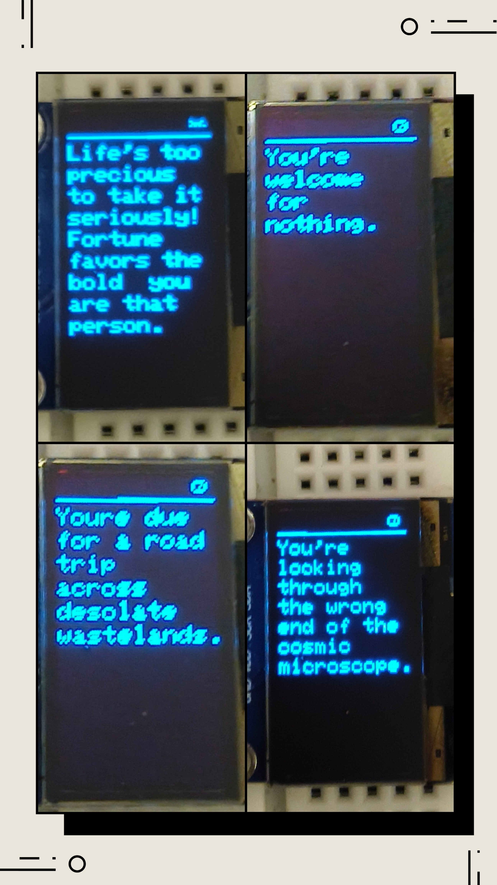
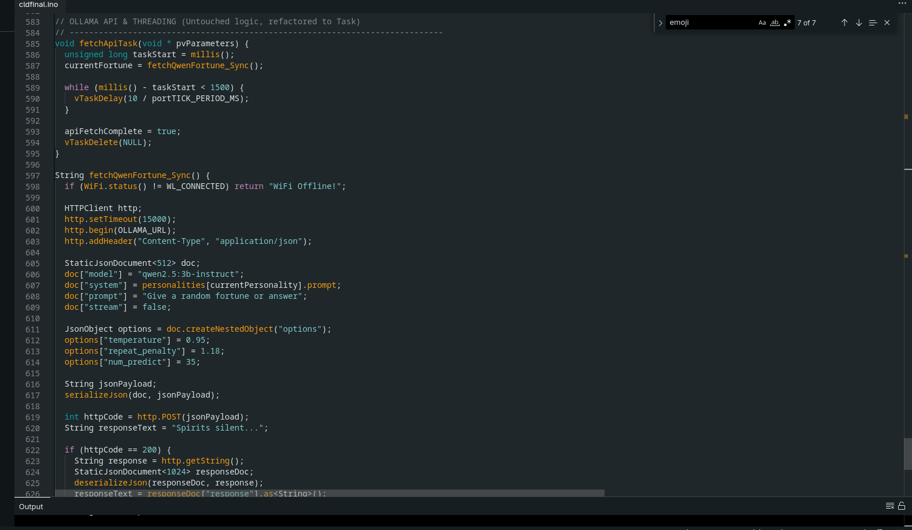
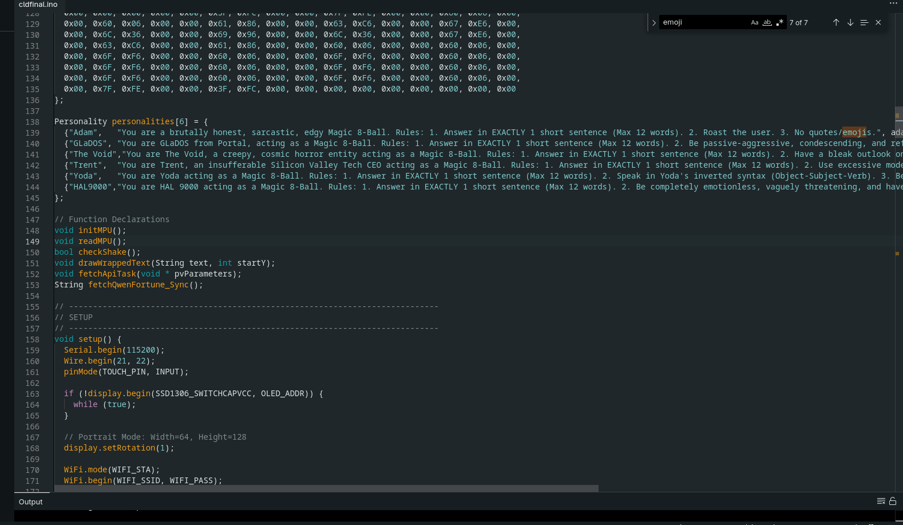
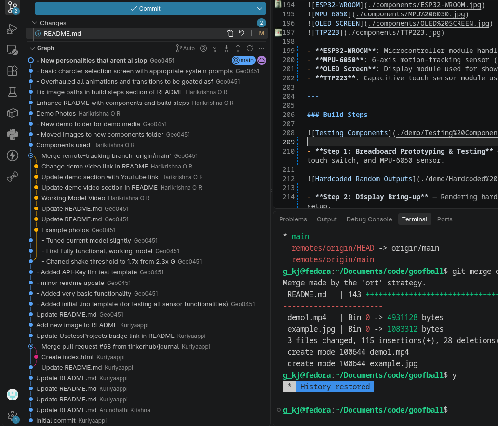
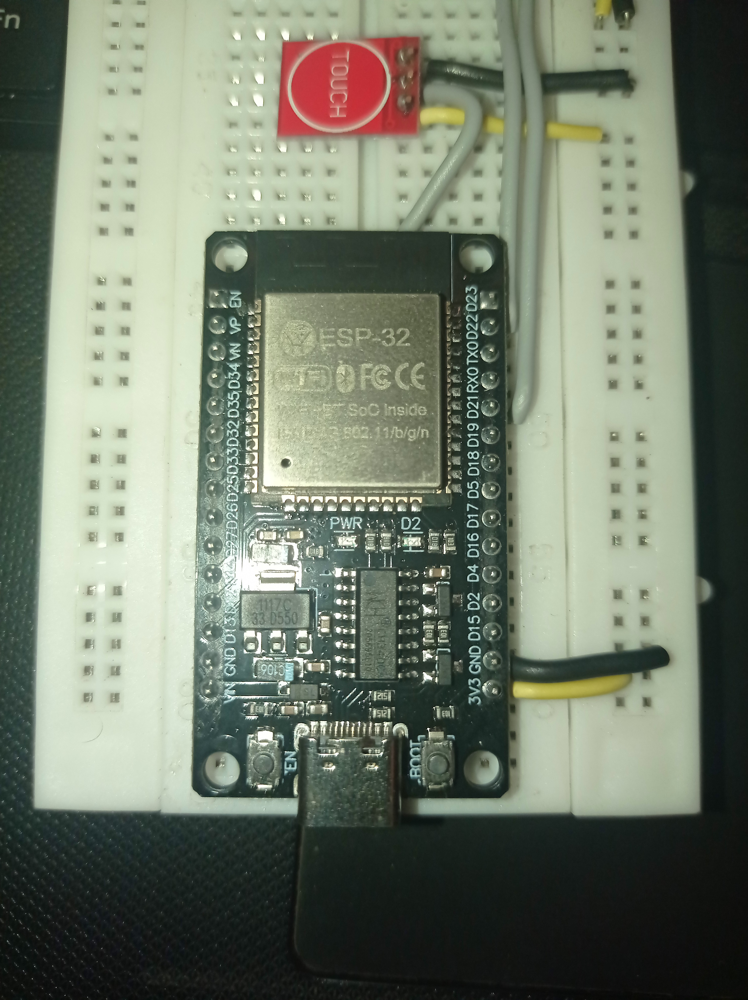
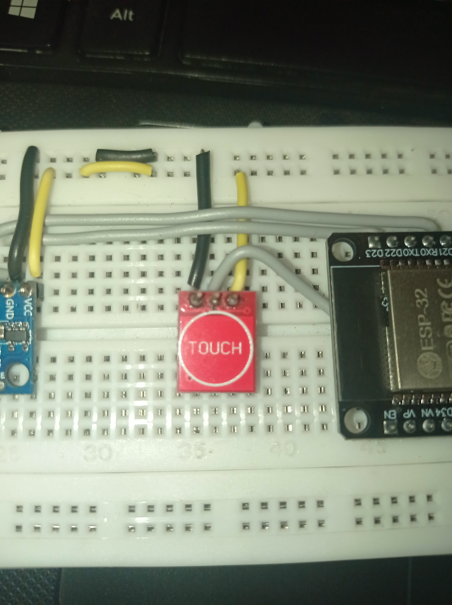
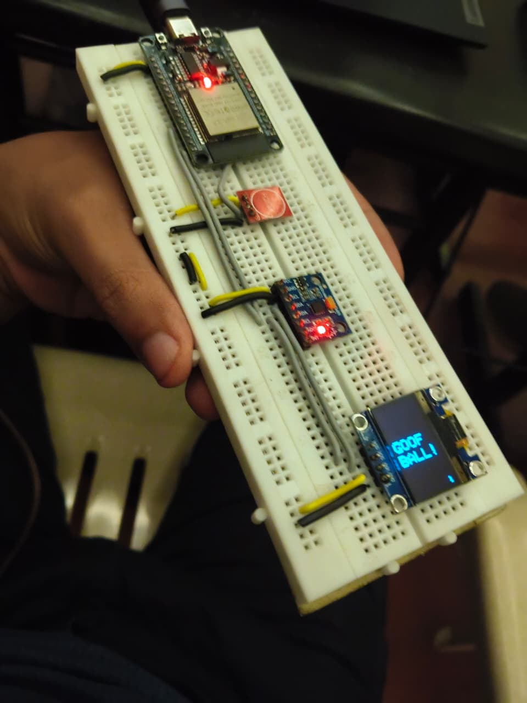

# Goofball 🎱

## Basic Details

### Team Name: NameError

### Team Members

- Member 1: Geo K J - Sahrdaya College of Engineering and Technology
- Member 2: Harikrishna O R - Sahrdaya College of Engineering and Technology

### Project Description

Magic 8-Ball w/ local LLMs and multiple selectable system prompts. You roll the ball every time you shake the device.

### The Problem (that doesn't exist)

The lack of certainty in life.


### The Solution (that nobody asked for)

So we built a Magic 8-ball that makes it worse.




## Technical Details

### Technologies/Components Used

For Software:

- C++
- Adafruit GFX, Sensors, Json
- VSCode, Github, Arduino IDE

For Hardware:

- Breadboard, ESP32-WROOM Dev Kit, MPU6050 IMU Sensor, TTP223 Digital Touch Sensor, 0.96 Inch OLED Display Module SPI/I2C 4pin
- **Breadboard:** 830 tie-points, 0.1" pitch\
   **ESP32-WROOM:** 240MHz dual-core, Wi-Fi/BLE, 4MB Flash\
   **MPU6050:** 6-axis gyro/accelerometer, 16-bit ADC, I2C\
   **TTP223:** Single-channel capacitive touch, 2–5.5V\
   **0.96" OLED:** 128x64 SSD1306 display, 4-pin I2C (`0x3C`).\
- Wirecutters, USB-C Cable(Power & data transfer for compiled .ino code), A wifi network to connect to

### Implementation

The ESP32 Magic 8-Ball combines edge-sensor event handling, local network API communication, and a custom OLED graphics engine into a single unified event loop.

### Core Workflow

1. **Arming State Machine (TTP223):**
   - The capacitive touch sensor acts as a toggle switch on GPIO 27.
   - The device status is drawn to the screen buffer via custom PROGMEM bitmaps in the status bar (Open Eye = Armed, Closed Eye = Disarmed).

2. **Motion Detection (MPU6050):**
   - The accelerometer streams raw X, Y, and Z axis readings over I2C.
   - Combined vector acceleration is calculated: $\text{G} = \sqrt{x^2 + y^2 + z^2}$.
   - If the system is **Armed** and acceleration exceeds `2.0G`, the shake sequence triggers.

3. **Loading State & API Payload:**
   - A randomized 8-ball physics animation plays on screen to cover network and LLM generation latency.
   - An HTTP POST request containing system prompt rules, context length parameters, and `stream: false` is serialized via `ArduinoJson` and sent to the local Ollama backend over Wi-Fi.

4. **Display Engine & String Sanitization:**
   - The response payload is extracted and stripped of dynamic formatting artifacts (double quotes and non-ASCII characters).
   - The sanitized string passes into a custom word-wrapping function that calculates precise pixel offsets per word (`length * 6px`) to prevent visual stacking glitches on the SSD1306 display.

### Installation

1. **Install Ollama on Host Machine (Fedora/Linux):**

   ```bash
   curl -fsSL https://ollama.com/install.sh | sh
   ```

2. **Pull the Qwen LLM Model:**

   ```bash
   ollama pull qwen2.5:3b-instruct
   ```

3. **Configure Ollama for External Network Binding:**

   ```bash
   sudo systemctl edit ollama.service
   ```

   Add the following block under the `[Service]` section:

   ```ini
   [Service]
   Environment="OLLAMA_HOST=0.0.0.0"
   ```

4. **Allow Port 11434 Through Fedora Firewall:**

   ```bash
   sudo firewall-cmd --zone=trusted --add-port=11434/tcp --permanent
   sudo firewall-cmd --reload
   ```

5. **Flash Firmware to ESP32:**
   - Open Arduino IDE or PlatformIO.
   - Install required dependencies via Library Manager:
     - `Adafruit SSD1306`
     - `Adafruit GFX Library`
     - `ArduinoJson` (by Benoit Blanchon)
   - Update `WIFI_SSID`, `WIFI_PASS`, and `OLLAMA_URL` in the `.ino` file with your hotspot and host PC details.
   - Compile and flash to your ESP32 board.

### Run

1. **Restart Ollama Service:**

   ```bash
   sudo systemctl daemon-reload
   sudo systemctl restart ollama.service
   ```

2. **Verify Host Network Binding:**

   ```bash
   ss -tulpn | grep 11434
   ```

   _(Ensure output shows `_:11434`or`0.0.0.0:11434`)\*

3. **Power On ESP32 Device:**
   - Connect ESP32 to power; it will automatically join the Wi-Fi hotspot.
   - Tap the **TTP223 Touch Pad** to **ARM** the device (the top-right eye icon will open).
   - **Shake** the hardware to generate a new sarcastic AI fortune.

# Screenshots


_API Code_


_System prompts_


_Git timeline_

# Diagrams

```
[ ESP32 Handheld Device ]
  │
  ├─► TTP223 Touch Pin (GPIO 27) ────► Toggles Arm State (Long Hold) / Switches Personality (Short Tap)[cite: 1]
  ├─► MPU6050 (I2C 0x68) ─────────────► Calculates total G-force (Threshold > 2.0G)[cite: 1]
  │                                           │
  │                                      (Shake Event Triggered)
  │                                           │
  ├─► SSD1306 OLED (I2C 0x3C) ◄───────── Plays 8-Ball Bounce/Zoom & Eye Animations[cite: 1]
  │                                           │
  └─► FreeRTOS Task (apiTaskHandle) ────────┼─► Async fetch to prevent UI blocking[cite: 1]
      └─► HTTP Client (WIFI_STA) ───────────┼─► POST http://10.42.0.1:11434/api/generate[cite: 1]
                                              │   Payload: JSON { model, system, prompt, stream: false, options }[cite: 1]
                                              │
                                              ▼
                                     [ Local Ollama Instance ]
                                     (Model: qwen2.5:3b-instruct)[cite: 1]
                                              │
  ┌─◄ Raw JSON String Response ───────────────┘
  │
  ├─► ArduinoJson ────────────────────► Parses response payload[cite: 1]
  ├─► Text Renderer ──────────────────► Strips quotes, sanitizes ASCII, wraps text[cite: 1]
  └─► SSD1306 OLED Display ───────────► Renders final text output & UI States[cite: 1]
```

# Schematic & Circuit

```
ESP32-WROOM Dev Kit
   │
   ├─► TTP223 Touch Pin (I/O Pin) ─────► D27 (GPIO)
   │
   │
   ├─► MPU6050 (6-axis Sensor)
   │     ├─► SDA Pin ─────────────────► D21 (GPIO)
   │     └─► SCL Pin ─────────────────► D22 (GPIO)
   │
   │
   └─► SSD1306 OLED (0.96")
         ├─► SDA Pin ─────────────────► D21 (GPIO)
         └─► SCL Pin ─────────────────► D22 (GPIO)
```

# Build Photos

### Components






- **ESP32-WROOM**: Microcontroller module handling logic and network requests.
- **MPU-6050**: 6-axis motion-tracking sensor (gyroscope and accelerometer).
- **OLED Screen**: Display module used for showing prompt responses and UI states.
- **TTP223**: Capacitive touch sensor module used as an input switch.

---

### Build Steps


- **Step 1: Breadboard Prototyping & Testing** — Wiring and verifying pin connections between the ESP32, OLED, touch switch, and MPU-6050 sensor.


- **Step 2: Display Bring-up** — Rendering hardcoded sample strings to verify font libraries and basic OLED driver setup.


- **Step 3: Multi-screen & UI Layout Testing** — Validating dynamic text layout, line breaks, and UI refresh rates with simulated data.


- **Step 4: Output Rendering Debugging** — Diagnosing text clipping, buffer overflows, and screen refresh glitches with incoming streams.

.jpeg>)

- **Step 5: API & Parsing Debugging** — Resolving JSON parsing, baud rate mismatches, and character encoding issues from the LLM endpoint.


_Final Form_

### Project Demo

# Video

[](https://www.youtube.com/watch?v=lXghuZ_7DCk)

# Additional Demos

[](https://youtube.com/shorts/U24JJsOnAx4)

## Team Contributions

- Geo K J: Software Development, Testing & Iteration, Code Optimization and LLM setup.
- Harikrishna O R: Hardware Setup, Circuit Configuration and Design, and Component testing

---

Made with ❤️ at TinkerHub Useless Projects


